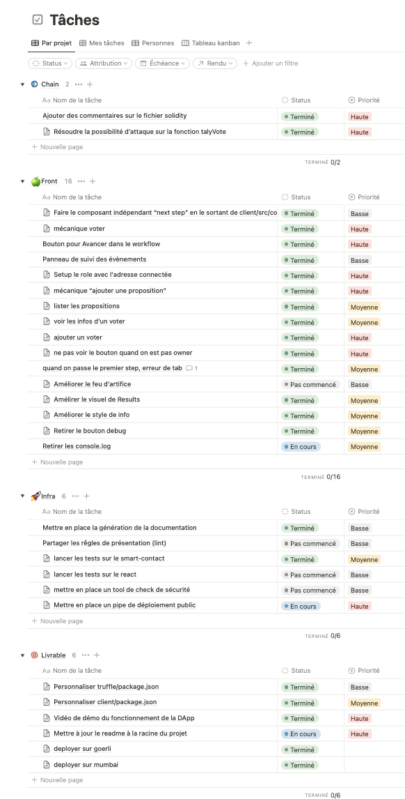

# Vote On Chain

Ce projet présente une application décentralisée basée sur la box truffle react.

Le Backend est écrit en solidity, testé en javascript, et déployé via truffle.
Il correspond au sous-dossier [truffle](./truffle)
et il a été déployé en local et
- sur Goerli : https://goerli.etherscan.io/address/0x8146AbBdA6416DfCC0E86b24A9294174f3Aa04e1
- sur Mumbai : https://mumbai.polygonscan.com/address/0xfabff559c69422517ce7290bf86c39217237815b

Le frontend est quant à lui conçu avec React, Web3 et MaterialUi.
Correspondant au sous-dossier [client](./client),
il est déployé sur https://alyra-av-od.vercel.app/.

Une vidéo de démonstration du fonctionnement de l'application est accessible sur
[https://www.loom.com/share/8b67f8ae2f5643fca695fbc5e8f81db4](https://www.loom.com/share/8b67f8ae2f5643fca695fbc5e8f81db4)

## Installation
```sh
gh repo clone adrien-vieilleribiere/Alyra-AV-OD
```

### Backend
```sh
cd truffle
npm install
truffle migrate
# add --network goerli or --network=mumbai for a public networks deployment
truffle test
```

### Frontend
```sh
cd client
npm install
npm npm run build
npm start
```

## Remarques sur le rendu

### Focus sur les events
La récupération des événements du contrat intelligent aura été notre bête noire pendant ce projet. Nous avons passé un temps énorme sur ce sujet. Initialement nous étions partis sur une solution combinant:
* `contract.getPastEvents`: récupération des événements à l'initialisation du bloc de déploiement jusqu'au bloc d'initialisation de la Dapp.
* `contract.events.MyEvent().on()`: récupération des nouveaux événements par la suite

Malheureusement nous avons rencontré de nombreux problèmes de remontées d'événements en doublon qui nous ont obligé à abandonner la deuxième méthode. Il semble y avoir une corrélation entre les doublons et le fait que plusieurs comptes soient connectés à la DApp via MetaMask.

Après plusieurs jours d'acharnement, nous avons dû nous résoudre, avec grande frustration, à ne gérer que les événements passés. Un changement d'onglet ou un rafraichissement de page est alors nécessaire pour mettre à jour l'application suite à de nouveaux événements qui auraient eu lieu sur le contrat (en dehors de l'application).
La méthode retenue consiste à utiliser `contract.getPastEvents` en maintenant la valeur du dernier bloc enregistré. D'une part pour limiter la surface de recherche, mais également pour éviter les enregistrements multiples. Chaque changement de tab déclenche le mise à jour les événements intérieurs et extérieurs à la DApp.

### Le reste du projet
Nous avons utilisé la librairie `Material UI (MUI)` pour disposer de composants et d'icônes réutilisables.

Chaque onglet met en avant une des méthodes du smart contract.

Nous avons centralisé, une partie des variables d'état de l'application dans le state du contexte `EthContext`. Ces dernières sont mises à jour avec des actions qui sont dispatchées en utilisant le hook `useDispatch`. C'est le cas notamment des variables: `user`, `voters`, `proposals`, `votes`.

La documentation du smart contract générée par docgen est située dans [./truffle/docs/index.md](truffle/docs/index.md).

Les commits sur les branches principales re-déclenchent l'ensemble des tests sur le contrat intelligent et le déploiement sur Vercel est également automatique.

Les points que nous aurions voulu avoir le temps de rajouter:
- la vue des propositions n'est accessible que dans l'onglet "Vote" ou l'onglet "Result", elle aurait sûrement mérité son propre onglet pour être accessible plus tôt dans le flow du vote.
- Nous aurions aimé documenter le react et automatiser la génération de la documentation du front.
- l'aspect responsive est encore perfectible sur quelques composants
- Pour tester l'application depuis un état particulier nous utilisions les lignes commentés de `truffle/migrations/01_deployVoting.js`, un système d'initialisation paramétrable aurait été encore mieux.
- La connexion à `MetaMask` se fait de manière automatique car les changements de réseau nous ont confronté à de nombreux comportements étonnants de `MetaMask`. Il serait pertinent d'utiliser une solution plus aboutie et pour plus de portefeuilles (WAGMI).

### Un aperçu de notre suivi de projet sous Notion.so


